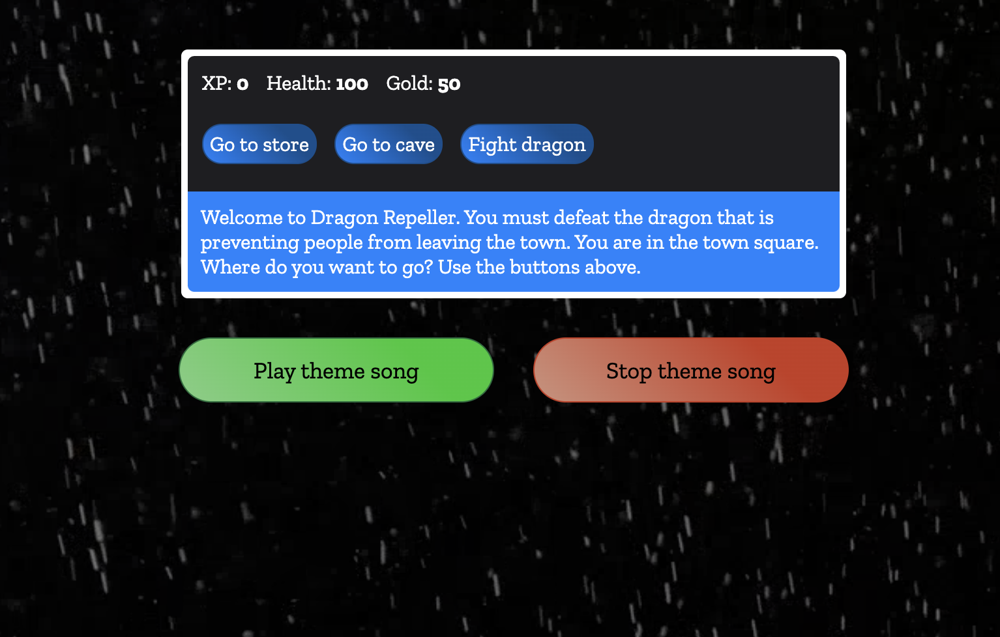

# Dragon Repeller - JavaScript RPG game

## Description
My motivation was to use my JavaScript skills to create a simple RPG game.
I built this project so that I can practice my JavaScript skills and challenge myself.
It's a very enjoyable gaming experience with a lot of interactivity from the users part and a lot of entertaining elements such as a custom theme song I created a while ago for a musical project I used to run called Pitchpilot, a custom video background and SFX for all interactive components of the game.
I learned how to integrate sound, background music and video backgrounds to make an entertaining game.
What makes my project stand out is that it uses a lot of entertaining elements users have come to expect out of a game.

## Table of Contents
- [Installation](#installation)
- [Usage](#usage)
- [License](#license)
- [Contributing](#contributing)
- [Tests](#tests)
- [Questions](#questions)

## Installation
No installation is required, to give the game a go use the deployed website link.

## Usage
To project is a game used for entertainment purposes.
The following image shows the web application's appearance and functionality:

> **Note**: This layout is designed to be responsive and offers audio feedback.

The following link will take you to the deployed webpage <https://agworkgit.github.io/dragon-repeller-rpg/>

## Tests
Does not require testing.

## Contributors
Alex Grigore

## Questions
For questions about the project, you can reach me at [GitHub: agworkgit](https://github.com/agworkgit) or contact me via email at agworksbox@gmail.com.

## License
This project is licensed under the MIT License.

## Badges

